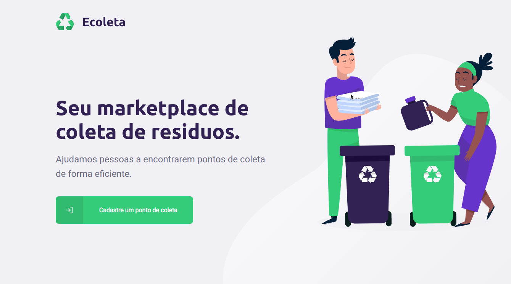

<h1 align="center">
   
    
   
  Ecoleta Frontend Web
</h1>

Network design of recyclable waste collection points.

  

## 📜 Features

<ul>
  <li>
Add new collection points.
</li>
</ul>

  

<ul>
  <li><a href="https://github.com/sartero/ecoleta-backend">Backend</a></li>
  <li><a href="https://github.com/sartero/ecoleta-frontend-mobile">Frontend Mobile</a></li>
</ul>

## 🧰 Techs

[//]: # "Add the features of your project here:"

- 💹 **Node.js** — A JavaScript runtime built on Chrome's V8;
- 💼 **React.js** — A JavaScript library for creating interfaces;
- 🔷 **Typescript** — A typed superset of JavaScript.

## 💻 Getting started

##### Note: You need to have the Backend of the application running. <a href="https://github.com/sartero/ecoleta-backend">You get it here.</a>

1. Clone this repo using <code>https://github.com/sartero/ecoleta-frontend-web</code>
2. Move to the appropiate directory: <code>cd mobile</code>
3. Run <code>yarn</code> or <code>npm install</code> to install the dependencies
4. Run <code>yarn start</code> or <code>npm start</code> to start the development server

## 🤓 How to contribute

<ul>
  <li>Fork this repository;</li>
  <li>Create a branch with your feature: <code>git checkout -b my-feature</code>;</li>
  <li>Commit your changes: <code>git commit -m 'feat: My new feature'</code>;</li>
  <li>Push to your branch: <code>git push origin my-feature</code>.</li>
</ul>

After the merge of your pull request is done, you can delete your branch.

## License

This project is licensed under the MIT License - see the [LICENSE](https://opensource.org/licenses/MIT) page for details.

<a href="http://github.com/sartero">Emanuel Vitor Souza</a>
